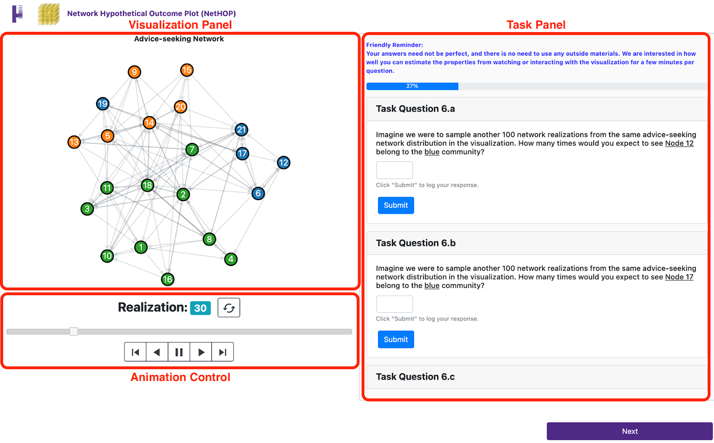

```{r setup, include=FALSE}
library(rjson)
library(dplyr)
library(magrittr)
library(stringr)
library(reshape2)
library(ggplot2)
library(ggpubr)
library(ggthemes) # tableau color pallett
library(scales)
library(gridExtra)
library(rlist)
library(boot) # confidence interval construction
library(moderndive)
library(infer)
library(Rlab) # for rbern
library(igraph)
library(intergraph)
library(statnet)
library(NetData)
library(graphlayouts)
library(networkDynamic)
library(DescTools)
knitr::opts_chunk$set(warning = FALSE, message = FALSE)
 # turn off all warning messages
# regular expression syntax
regEx_taskName = "^[^_]+(?=_)"
regEx_tungFlag = "(?<=_)([^_]+)(?=_)"
regEx_taskquestion = "[^_]([^_]+)$"
```

# 1. Study Interface
Our study interface is built in HTML, CSS, and JavaScript. The code is available at [https://github.com/dpzhang/NetHOPs](https://github.com/dpzhang/NetHOPs)

## 1.1 Participants' Qualification Test
Participants' qualification test is based on a simple static network shown in Figure 1 below.
```{r qualification test, eval=FALSE}
# Construct network
set.seed(5)
n = 8
p = 1/4
g = sample_gnp(n = n, p = p, directed = T) %>%
  add_vertices(2) 
g = g - edge("3|2")

# Community detection
set.seed(1)
plot(cluster_optimal(g), g, edge.color = "black")
```
```{r qualification test fig insert, echo=FALSE, fig.align = 'center', out.width = "40%", fig.cap = "The network used for the participant qualification test."}

```

We asked a total of 7 questions:

* Question 1: Nodes
How many nodes are there in the network?

* Question 2: Links
How many links are there in the network?

* Question 3: Directionality
Is it a directed or undirected network?

* Question 4: Isolates
How many isolates are there in the network? By isolate, we mean a node that is not connected with any other node.

* Question 5: Communities
How many communities are there in the network? By community, we mean a collection or cluster of, at least, 2 nodes.

* Question 6: Shortest Path
How many links are there on the shortest path from node 6 to node 1?

* Question 7: 
On a scale from 0 to 1, what is the density of this network? Please round off your responses to 2 decimal places. (Tip: Please use your responses from Question 1 and Question 2 to compute density)
    + 0 means an empty graph with no link.
    + 1 means a fully connected graph.

## 1.2 Interface without Tuning
Figure 2 provides an example screen for our interface for the 11 task pages **without tuning**. Participants see a Visualization Panel on the left and a Task Panel on the right. The visualization consists of realizations sampled using our network model. 
```{r default no tuning, echo=FALSE, fig.align = 'center', out.width = "80%", fig.cap = "Study interface with default NetHOPs parameters."}

```

Below the animated visualization is the Animation Control, shown in Figure 3. There are seven buttons, and participants were instructed to use the animation control as much as they want when answering the task questions.
```{r animation control panel, echo=FALSE, fig.align = 'center', out.width = "80%", fig.cap = "Animation controls used to manipulate NetHOPs rendering."}

```
Here is a brief description of the possible controls:

* Reset Button: Click to reset the animation back to simulation 1.
* Draggable Slider: drag the marker to specific realization.
* Previous Frame: When paused, click to go to the previous realization.
* Backward Play: Click to play the animation backward.
* Pause: Click to pause the animation.
* Forward Play: Click to play the animation forward.
* Next Frame: When paused, click to go to the subsequent realization.

## 1.3 Interface with Tuning
We show an example of our interface of the 11 task pages **with tuning** in Figure 4. Participants were instructed to change their responses if they felt confident that tuning the visualization parameters could improve their previous responses.
```{r tuning, echo=FALSE, fig.align = 'center', out.width = "80%", fig.cap = "Study interface that allows participants to customize  NetHOPs rendering."}

```

# 2. Prototype Construction
This section of the supplementary material demonstrates how we constructed our NetHOPs prototype using Krackhardt's CSS dataset.

We load Krackhardt's CSS datasets and import the necessary helper functions required to construct the prototypes.
```{r load css}
load('./data/krackhardtCSS/krackhardt_css_data.RData')
source('./scripts/helper-nodeColoring.R')
source('./scripts/helper-dynamicLayout.R')
source('./scripts/helper-miscProto.R')
```

NetHOPs construction pipeline is demonstrated below.
```{r construction, eval=FALSE}
# For the advice-seeking CSS
adviceNets150 = draw_nNets(advice_nets, 150, seed = 1) %>% # draw networks
  # Cluster detection on each sampled network realizations.
  detect_communities(igraph::cluster_optimal, seed = 1) %>% 
  # Send the sampled network realizations to our instant-optimal 
    # community matching and coloring algorithm
  create_nodeColorAttribute %>% 
  # Apply the layout aggregation and anchoring algorithm
  add_anchoringCoordinate(weights = NA, 
                          alpha = 0, iter = 500, tol = 1e-04, seed = 1) %>%
  # Normalize the layout coordinate
  normalize_layoutCoordinate

# The same process implemented on the friendship CSS
friendNets150 = draw_nNets(friendship_nets, 150, seed = 1) %>%
  detect_communities(igraph::cluster_optimal, seed = 1) %>% 
  create_nodeColorAttribute %>% 
  add_anchoringCoordinate(weights = NA, 
                          alpha = 0, iter = 500, tol = 1e-04, seed = 1) %>%
  normalize_layoutCoordinate
```

The processed data used to construct the NetHOPs prototypes can be found in the `data` directory.

# 3. Analysis Demonstration
In this section of the supplementary material, we reproduce our analysis by first importing processed user response datasets as shown in the code block below. Due to IRB, we cannot release our full dataset. Among the data frames imported:

## 3.1 Data Preparation 
* `userResponseDF`: is the data frame that contains participants' responses submitted (1) using the default visualization parameters and graphical elements (Table 1 in the paper). (2) given the freedom to tune the visualization parameters and graphical elements.
* `visParamDF`: is the data frame that contains the visualization parameters and graphical elements used in the second iteration tuned by participants.
* `scoreDF`: is the data frame that contains the performance evaluation metrics, that are (1) EMD scores and (2) probability estimation.
* `truthDF`: is the data frame that contains the ground truth network property or statistics for each network realization sampled from the advice-seeking and friendship CSS data.

```{r data loading}
userResponseDF = read.csv("./data/userResponse.csv")
visParamDF = read.csv("./data/visParam.csv")
scoreDF = read.csv("./data/score.csv")
truthDF = read.csv("./data/groundTruth/truth150.csv") %>%
  mutate(AD = AD * 100, FD = FD * 100) # convert densities to percentage

# Total number of participants
numParticipants = nrow(userResponseDF)
# Subset scoreDF by tuning and noTuning
part1DF = scoreDF %>% select(contains("_noTune"))
part2DF = scoreDF %>% select(contains("_tune"))
```

We first present participants' demographics, which was described in Section 4.5 and 5.1 of the paper.
```{r participants demographics}
# study the demographics of users
numUsers = userResponseDF %>% nrow
userInfoDF = userResponseDF %>% 
  select(starts_with("demographics")) 

# Summary statistics of user demographics
userInfoDF %>% 
  select(demographics_education, 
         demographics_class, 
         demographics_networkUse) %>%
  lapply(table) %>%
  lapply(function(x) x / numUsers)

# Calculate user study time completion without removing the outlier
studyTimeVec = userResponseDF %>% 
  select(ends_with("timeSpent")) %>%
  apply(1, sum) %>%
  `/`(60) %>%
  round(0)
summary(studyTimeVec)
sd(studyTimeVec)
```

## 3.2 Performance Overview
We reproduce Figure 5 of the paper, in which we provide an overview of participants' task performance. We first load the helper functions from the `scripts` directory. 
```{r performance overview helper functions}
source("./scripts/helper-miscAnalysis.R")
source("./scripts/helper-plot-allUserResponses.R")
```

Participants' responses are superimposed against the ground truth distribution or probability below.

* Task with discrete responses.
```{r discrete, fig.height = 4, fig.width = 8, fig.align = "center"}
discretePlot_bar +
  theme(legend.position = "bottom",
        strip.text.x = element_text(size = 8))
```

* Task with continuous responses.
```{r continuous, fig.height = 4, fig.width = 8, fig.align = "center"}
continuousPlot_density +
  theme(legend.position = "bottom",
        strip.text.x = element_text(size = 8))
```

* Empirical cumulative distributions functions for all distribution elicitation tasks. Barplots and density curves differentiate the discrete and continuous responses. 
```{r cdf, fig.height = 4, fig.width = 8, fig.align = "center"}
discretePlot_cdf +
  theme(legend.position = "bottom",
        strip.text.x = element_text(size = 8))
continuousPlot_cdf +
  theme(legend.position = "bottom",
        strip.text.x = element_text(size = 8))
```

* Strip plots present participants’ deterministic probability estimates with 95% bootstrapped CIs for each attribute-based task from the study. The ground truth probabilities for each task are shown as red points between the CIs. We elicited four probability estimates for node-attribute tasks and two for edge-attribute tasks from advice-seeking and friendship networks.
```{r probability, fig.height = 4, fig.width = 8, fig.align = "center"}
nodeStabilityPlot +
  theme(legend.position = "bottom",
        strip.text.x = element_text(size = 8))
edgeOccurrencePlot +
  theme(legend.position = "bottom",
        strip.text.x = element_text(size = 8))
```

As mentioned in Section 5.1, we discovered a data anomaly for the browsing task of the friendship network. About half of participants (22) incorrectly assumed some realizations have the shortest path length of zero (Figure 6 A, left, the second column), when theoretically it should be infinity and therefore not counted when sketching the distributions. This conceptual misunderstanding led to more divergence (i.e., higher EMD scores) in response quality for this task.
```{r data anomaly, fig.height = 4, fig.width = 8, fig.align = "center"}
# Subset the browsing task of the friendship network
taskDF = userResponseDF %>% 
  select(contains(paste0("FSP", "_")) & 
           contains(paste0("_", "tune")) & 
           matches("distLabels|distResponse"))
head(taskDF, 5)

# Loop through all 51 user responses to check number of bals in the "0" bucket
obs_lst = list()
for(i in 1:nrow(taskDF)){
  labels = taskDF %>% select(contains("distLabels")) %>%
    slice(i) %>% pull %>%
    as.character %>% strsplit(",") %>% unlist %>% as.numeric
  responses = taskDF %>% select(contains("distResponse")) %>%
    slice(i) %>% pull %>%
    as.character %>% strsplit(",") %>% unlist %>% as.numeric
  obs = rep(labels, times = responses)
  obs_lst %<>% list.append(obs)
}
# Check how many participants committed the error
obs_lst %>% 
  lapply(function(x) 0 %in% x) %>% 
  unlist %>% mean %>% `*`(numParticipants)
```

* We present the bootstrapped performance metrics (EMD and probability estimation error) for each task below. To do so, we first load the helper functions.
```{r helper for CI}
source("./scripts/helper-performanceAnalysis.R")
```

## 3.3 Performance Evaluation
Below are the 95% CIs for tasks evaluated by EMD. These tasks include (1) Topology (the number of distinct communities), (2) Overview (isolates and density), (3) Browsing (shortest path length).
```{r emd score CI}
CIDF %>%
  mutate(taxonomy = case_when(str_detect(task, "Community") ~ "Topology",
                              str_detect(task, "Density") ~ "Overview-Density",
                              str_detect(task, "Isolate") ~ "Overview-Isolate",
                              str_detect(task, "Path") ~ "Browsing")) %>%
  filter(question == "EMD") %>%
  select(taxonomy, data, tuneFlag, lower_ci, mu_hat, upper_ci) %>%
  knitr::kable(.)
```

Below are the 95% CIs for tasks evaluated by probability estimation error, which include node-attribute (distinct community) and edge attribute (edge occurrence) tasks.
```{r probability CI}
CIDF %>%
  mutate(taxonomy = case_when(str_detect(task, "Stability") ~ "Node",
                              str_detect(task, "Occurrence") ~ "Edge")) %>%
  filter(question != "EMD") %>%
  select(taxonomy, data, question, tuneFlag, lower_ci, mu_hat, upper_ci) %>%
  knitr::kable(.)
```

To visualize all CIs, we reproduce Figure 6 of the paper below.
```{r CI for all EMD, fig.height = 4, fig.width = 8, fig.align = "center"}
allEMD
```

```{r CI for all deterministic, fig.height = 4, fig.width = 8, fig.align = "center"}
allDeterministic
```

We summed each participants' EMD scores for all tasks completed with and without tuning and computed the average amount of improvement. We found that the ability to control NetHOPs rendering could improve participants' distribution elicitation by 4% on average (Note: negative values indicate decreased EMD score, which means performance improvement).
```{r improvement EMD}
# Does tuning improve participants' distribution elicitation on average?
noTune_EMD = part1DF %>%
  select(!contains(c("AUN", "FUN", "AEO", "FEO"))) %>% abs %>% apply(1, sum)
tune_EMD = part2DF %>% 
  select(!contains(c("AUN", "FUN", "AEO", "FEO"))) %>% abs %>% apply(1, sum)
EMD_diff = data.frame(diffPercent = (tune_EMD - noTune_EMD) / noTune_EMD)
mu_hat_EMD_diff = EMD_diff %>% pull(diffPercent) %>% mean
set.seed(2333)
EMD_diff %>%
  specify(response = diffPercent) %>%
  generate(reps = 10000, type = "bootstrap") %>% 
  calculate(stat = "mean") %>%
  get_confidence_interval(type = "se", point_estimate = mu_hat_EMD_diff) %>%
  mutate(mu_hat = mu_hat_EMD_diff) %>%
  select(lower_ci, mu_hat, upper_ci) 
```

We computed a similar statistic by aggregating the total absolute error for probability estimation tasks, and found tuning visualization parameters did not improve probability estimation.
```{r improvement probability}
# Does tuning improve participants' deterministic guess on average?
noTune_guess = part1DF %>%
  select(contains(c("AUN", "FUN", "AEO", "FEO"))) %>% abs %>% apply(1, sum)
tune_guess = part2DF %>% 
  select(contains(c("AUN", "FUN", "AEO", "FEO"))) %>% abs %>% apply(1, sum)
guess_diff = data.frame(
  diffPercent = (tune_guess - noTune_guess) / noTune_guess)
mu_hat_guessDiff = guess_diff %>% pull(diffPercent) %>% mean
set.seed(2333)
guess_diff %>%
  specify(response = diffPercent) %>%
  generate(reps = 10000, type = "bootstrap") %>% 
  calculate(stat = "mean") %>%
  get_confidence_interval(type = "se", point_estimate = mu_hat_guessDiff) %>%
  mutate(mu_hat = mu_hat_guessDiff) %>%
  select(lower_ci, mu_hat, upper_ci) 
```

We found 22% (11) of our participants provided the same answers in the second iteration of tasks.
```{r number of participants who did not change their responses in tuning}
source("./scripts/helper-checkSameResponse.R")
(noTuneResponseDF == tuneResponseDF) %>% 
  apply(1, sum) %>% 
  `==`(ncol(noTuneResponseDF)) %>% sum
```

Since we observe tuning visualization parameters only slightly helped participants' EMD scores, a natural follow-up question is: what are the distributions of EMD score and probability estimation error look like?
```{r difference in distribution of performance metrics, fig.height = 6, fig.width = 4, fig.align = "center"}
source("./scripts/helper-distPerformancePlot.R")
ggarrange(EMDScoreDistPlot, probabilityErrorDistPlot,
          nrow = 2, common.legend = T, legend = "bottom") 
```

The distributions of the two performance metrics indicate that tuning did help some participants. Below, we present the summed performance metrics including EMD (top) and probability estimation error (bottom) with and without tuning. To investigate the dynamics between visualization parameters and accuracy, we ranked all participants by their performance with tuning. From the rank, we grouped top-performers from the first quartile and bottom-performers from the fourth quartile, with each group consisting of 13 participants.
```{r rank participants in the round with tuning}
# The within variance of vis parameters by subtask is minimal within each task
# To test it, please run the following code
#source("./scripts/helper-paramVariance.R")
#compute_allParam_variance_bySubtasks(visParamDF)

# For distribution sketching tasks, we select the visualization parameters used 
  # for the distribution builder
# For probability estimation tasks, we randomly select a set of the 
  # visualization parameters for the first task
source("./scripts/helper-reduceVisParamDF.R")
sVisParamDF = reduce_visParamDF(visParamDF)

# Rank all participants by score
rankingDF = data.frame(user = userResponseDF$userID,
                       email = userResponseDF$demographics_email,
                       totalScore = scoreDF %>% abs %>% apply(1, sum),
                       part1Score = part1DF %>% abs %>% apply(1, sum),
                       part2Score = part2DF %>% abs %>% apply(1, sum)) %>%
  arrange(part2Score)

# Group the total scores thats in the 1st quartile and 3rd quartile
firstQuartile = quantile(rankingDF$part2Score, 0.25) 
thirdQuartile = quantile(rankingDF$part2Score, 0.75)
# Find the participants corresponding tot he score
user1Q = rankingDF %>%
  filter(part2Score <= firstQuartile) %>%
  pull(user) %>%
  as.character
user3Q = rankingDF %>%
  filter(part2Score >= thirdQuartile) %>%
  pull(user) %>%
  as.character

# Create dataframes for each group of participants
  # vis parameters used by top-performers
topVisParamDF = sVisParamDF[userResponseDF$user %in% user1Q,]
  # scores of the top-performers
topScoreDF = scoreDF[userResponseDF$user %in% user1Q,]
  # vis parameters used by bottom-performers
bottomVisParamDF = sVisParamDF[userResponseDF$user %in% user3Q,]
  # scores of the bottom-performers
bottomScoreDF = scoreDF[userResponseDF$user %in% user3Q,]
```

Below are the EMD score summaries of the top-performers and bottom-performers.
```{r score summary - EMD}
# Top-performer EMD score summary
topUser_avgScore = topScoreDF %>% 
  select(matches("AC|FC|I|ASP|FSP|AD|FD") & matches("_tune")) %>%
  apply(1, mean)
present_summaryStats(topUser_avgScore) %>%
  knitr::kable(.)

# Bottom-performer EMD score summary
bottomUser_avgScore = bottomScoreDF %>% 
  select(matches("AC|FC|I|ASP|FSP|AD|FD") & matches("_tune")) %>%
  apply(1, mean) 
present_summaryStats(bottomUser_avgScore) %>%
  knitr::kable(.)
```

Below are the summaries of performance for probability estimation tasks by top-performers and bottom-performers.
```{r score summary - probability}
# Top-performer probability estimates
topUser_avgGuess = topScoreDF %>% 
  select(matches("AUN|FUN|AEO|FEO") & matches("_tune")) %>%
  apply(1, mean) %>% abs
present_summaryStats(topUser_avgGuess) %>%
  knitr::kable(.)

# Bottom-performer probability estimates
bottomUser_avgGuess = bottomScoreDF %>% 
  select(matches("AUN|FUN|AEO|FEO") & matches("_tune")) %>%
  apply(1, mean) %>% abs
present_summaryStats(bottomUser_avgGuess) %>%
  knitr::kable(.)
```

## 3.4 Visualization Parameters and Graphical Visual Aids
We focused on how anchoring and animation speed were used by each group and present the bootstrapped mean with 95% CIs to assess how the parameters seemed to relate to task performance.
```{r parameter CI helper function}
source("./scripts/helper-paramCI.R")
```

* 95% CI for the anchoring alpha parameter.
```{r parameter CI alpha}
# Alpha: Top vs. Bottom
compute_CI_subset(masterDF, parameter = "alpha", user = "Top") 
compute_CI_subset(masterDF, parameter = "alpha", user = "Bottom")

# Alpha: Advice vs Friendship
compute_CI_subset(masterDF, parameter = "alpha", data = "Advice-seeking")
compute_CI_subset(masterDF, parameter = "alpha", data = "Friendship")

# Alpha: Top advice vs. Top friendship
compute_CI_subset(masterDF, parameter = "alpha", user = "Top", data = "Advice-seeking")
compute_CI_subset(masterDF, parameter = "alpha", user = "Top", data = "Friendship")

# Alpha: Bottom advice vs. Bottom friendship
compute_CI_subset(masterDF, parameter = "alpha", user = "Bottom", data = "Advice-seeking")
compute_CI_subset(masterDF, parameter = "alpha", user = "Bottom", data = "Friendship")
```

* 95% CI for the animation speed.
```{r parameter CI animation speed}
# Animation Speed: Top vs Bottom
compute_CI_subset(masterDF, parameter = "frameRate", user = "Top")
compute_CI_subset(masterDF, parameter = "frameRate", user = "Bottom")

# Alpha: Advice vs Friendship
compute_CI_subset(masterDF, parameter = "frameRate", data = "Advice-seeking")
compute_CI_subset(masterDF, parameter = "frameRate", data = "Friendship")

# Alpha: Top advice vs. Top friendship
compute_CI_subset(masterDF, parameter = "frameRate", user = "Top", data = "Advice-seeking")
compute_CI_subset(masterDF, parameter = "frameRate", user = "Top", data = "Friendship")

# Alpha: Bottom advice vs. Bottom friendship
compute_CI_subset(masterDF, parameter = "frameRate", user = "Bottom", data = "Advice-seeking")
compute_CI_subset(masterDF, parameter = "frameRate", user = "Bottom", data = "Friendship")
```

We compute the 95% CI for each of the visualization parameters (anchoring alpha and animation speed) by task and by group for each CSS dataset. We show a glimpse of the CI data below.
```{r slider parameter CI df}
source("./scripts/helper-sliderSwitcherParamCI.R")
head(ciDF, 10)
```

To visualize all parameter CIs, we recreate Figure 7 of the paper below.
```{r parameter CI visualization figure 7}
sliderParamPlot
```

We compute the percentage of participants who used each of the graphical elements (edge opacity, node color, convex hulls, and node labels) by task and by group for each CSS dataset. Again, we show a glimpse of the percentage data below. 
```{r switcher parameter use rate}
head(switcherPlotDF, 10)
```

To visualize the use of graphical elements and visual aids, we recreate Figure 8 of the paper below.
```{r switcher visualization figure 8}
switcherPlot
```

## 3.5 Precision of Inference & Time-Accuracy Correlation

As mentioned in Section 5.4 of the paper, two forms of error can impact the precision of inferences about network statistics made with NetHOPs: perceptual and cognitive errors related to how accurately analysts can estimate probabilities from the visualization (which applies to any visualizations of distributions), and approximation error introduced by sampling from the network model.

We load the scripts for all the helper functions needed to quantify the sampling error introduced when taking a set of random draws from the graph model. 
```{r EMD bias helper loading, eval=FALSE}
source("./scripts/helper-EMDBias.R")
```

The script processing time is long. The output EMD bias can be directly loaded from the `data` directory.
```{r load EMD bias df}
EMDBiasDF = read.csv("./data/EMDbias.csv")
EMDBiasDF %>% head(10) %>% knitr::kable(.)
```

We cannot compute approximation error against the ground truth model, we can infer it by re-sampling $N$ sets of network realizations from the model and using the distributions of network statistics from each re-sampled set to compute EMD scores against those from the set of NetHOPs. We can then quantify the sampling error of the distribution for each network statistic in the unit of EMD by constructing a confidence interval. Therefore, if a participant perfectly perceived and sketched a distribution and received an EMD score of zero using NetHOPs, her perception could be off by an $\mu_{EMD} \pm SE_{EMD}$ amount. This approach is generalizable and can be easily applied to compute the sampling error of any probability estimation tasks.

We show a glimpse of the EMD bias CIs computed.
```{r emd show bias sample}
biasCIDF = data.frame(mean = EMDBiasDF %>% apply(2, mean) , 
                      se = EMDBiasDF %>% 
                        apply(2, function(x) sd(x) / sqrt(length(x)))) %>%
  mutate(var = rownames(.)) %>%
  mutate(network = ifelse(substring(var, 1, 1) == "A", 
                          "Advice-seeking", "Friendship")) %>%
  mutate(task = case_when(var == "AC" ~ "Distinct\nCommunity",
                          var == "FC" ~ "Distinct\nCommunity",
                          var == "FI" ~ "Isolate",
                          var == "AD" ~ "Density",
                          var == "FD" ~ "Density",
                          var == "ASP" ~ "Shortest Path\nLength",
                          var == "FSP" ~ "Shortest Path\nLength")) %>%
  mutate(task = factor(task, levels = c("Distinct\nCommunity", "Density", 
                                        "Shortest Path\nLength", "Isolate")))
biasCIDF %>% head(10) %>% knitr::kable(.)
```

We recreate Figure 9 of the paper to visualize the sampling error of the network statistics.
```{r recreate figure 9 of the paper, fig.height = 4, fig.width = 8, fig.align = "center"}
ggplot(biasCIDF, aes(x=task, y=mean, group = task)) + 
  geom_point(color = "#4E2A84", size = 0.8)+
  geom_errorbar(aes(ymin=mean-se, ymax=mean+se), width=.2,
                position=position_dodge(0.05), color = "#4E2A84") + 
  labs(x = NULL, y = "Sampling Error (EMD)") + 
  facet_grid(cols = vars(network), scale = "free", drop = T) + 
  theme_minimal() +
  theme(axis.title.y = element_text(size = 10),
        axis.text.x = element_text(size = 9),
        strip.text.x = element_text(size = 12))
```

As also mentioned in Section 5.4, our participants may not view all NetHOPs' realizations. While we did not log exact realizations viewed, we can use time spent on tasks to infer approximate viewing.

We first present the summary statistics of the task completion time without the outlier. 
```{r task time distribution}
# Identify the outlier
outlier_i = userResponseDF %>% 
  select(ends_with("timeSpent")) %>% 
  select(-test_timeSpent, -demographics_timeSpent) %>% 
  `/`(60) %>%
  apply(1, sum) %>%
  which.max()

# Compute the task completion time by participants
taskCompletionTimeVec = userResponseDF %>% 
  select(ends_with("timeSpent")) %>% 
  select(-test_timeSpent, -demographics_timeSpent) %>% 
  `/`(60) %>%
  apply(1, sum)

# Present the summary statistics
taskCompletionTimeVec_noOutlier = taskCompletionTimeVec[-outlier_i]
c(summary(taskCompletionTimeVec_noOutlier), "sd" = sd(taskCompletionTimeVec_noOutlier))
```

We show the distribution of study completion time below.
```{r distribution of task completion time, fig.height = 4, fig.width = 8, fig.align = "center"}
source("./scripts/helper-correlationAnalysis.R")
timeDistPlot
```

We show the distributions of completion time by task. 

* Construct the dataframe that records the amount of time spent on each task.
```{r}
timeSpentDF %>% select(-taskName) %>% head(10) %>% knitr::kable(.)
```

* Visualize the distribution of time spent by task. 
```{r visualize the time spent by task plot, fig.height = 4, fig.width = 8, fig.align = "center"}
timeDist_byTask_plot
```

To assess whether spending more time on a task correlated with performance, we conducted a correlation analysis between task completion time and response quality by computing Pearson's correlation coefficient for each task, then using Fisher's Z-Transformation to meet the normality assumption.
```{r}
cor_byTaskDF %>% select(-taskName) %>%
  select(task, network, tuneFlag, lwr.ci, cor, upr.ci) %>% 
  head(10) %>% knitr::kable(.)
```

Recreate Figure 10 of the paper and show the CIs of the correlation.
```{r, fig.height = 4, fig.width = 8, fig.align = "center"}
corOverViewPlot
```